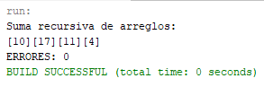

# Java Recursive Array Sum

Java exercise focused on array addition and the structure of a method intended to perform recursive processing.

## Description

This project contains a Java program called `SumaRecursiva` that works with two integer arrays and calculates the element-by-element sum between them.

The program uses the following arrays:

```text
arr1 = {5, 8, 9, 2}
arr2 = {5, 9, 2, 2}
```

The addition is performed position by position:

```text
5 + 5 = 10
8 + 9 = 17
9 + 2 = 11
2 + 2 = 4
```

The resulting values are displayed in the console.

The project was created as an exercise involving arrays, methods, positions within arrays, and an intended recursive approach.

## Features

- Uses integer arrays.
- Performs element-by-element addition.
- Displays the resulting values in the console.
- Defines a method named `sumarValores`.
- Passes an array and an array position to the method.
- Demonstrates the structure of a recursive-array exercise.

## Technologies

- Java
- Arrays
- Methods
- Console output
- `Scanner`
- NetBeans

## Project Structure

```text
Java-Recursive-Array-Sum/
│
├── src/
│   └── sumarecursiva/
│       └── SumaRecursiva.java
│
├── screenshots/
│   └── console-output.png
│
├── README.md
├── LICENSE
└── .gitignore
```

## Program Logic

The program creates two integer arrays:

```java
int[] arr1 = {5, 8, 9, 2};
int[] arr2 = {5, 9, 2, 2};
```

A third array is created to store the addition results:

```java
int sumas[] = new int[arr1.length];
```

Each position is processed using the following operation:

```java
sumas[x] = arr1[x] + arr2[x];
```

For the current arrays, the resulting values are:

```text
[10][17][11][4]
```

## Method Structure

The main method calls:

```java
sumarValores(arr, arr.length - 1)
```

The method receives:

```java
public static int sumarValores(int array[], int posArray)
```

The parameters represent an integer array and a position within the array.

The exercise is structured around the concept of recursively processing array elements. However, in the current version of the source code, the addition itself is performed using a `for` loop rather than a recursive call.

The current implementation is therefore preserved as the original academic exercise rather than being presented as a completed recursive implementation.

## Current Implementation

The addition loop is:

```java
for (int x = 0; x < sumas.length; x++) {
    sumas[x] = arr1[x] + arr2[x];
    System.out.print("[" + sumas[x] + "]");
}
```

This produces one result for each corresponding pair of elements.

## Example

Given:

```text
arr1 = {5, 8, 9, 2}
arr2 = {5, 9, 2, 2}
```

The calculations are:

```text
Position 0: 5 + 5 = 10
Position 1: 8 + 9 = 17
Position 2: 9 + 2 = 11
Position 3: 2 + 2 = 4
```

Result:

```text
[10][17][11][4]
```

## Console Output

The program also prints the text:

```text
ERORES:
```

and returns:

```text
0
```

An example execution is:

```text
[10][17][11][4]
ERORES: 0
```

## Learning Objectives

This exercise demonstrates concepts related to:

- Integer arrays.
- Array indexing.
- Element-by-element operations.
- Passing arrays to methods.
- Passing array positions as method parameters.
- Creating result arrays.
- Iterating through arrays.
- Console output.
- The intended structure of a recursive array-processing exercise.

## Notes

The current source code contains elements prepared for a recursive implementation, including the `posArray` parameter and the method name `sumarValores`.

However, the current version performs the addition with a `for` loop and does not make a recursive call to `sumarValores`.

The repository preserves the original implementation as developed for the exercise.

## Screenshots

### Console Output

The screenshot shows the program execution and the addition results printed to the console.



## Author

**Luis Alva**

## License

This project is licensed under the MIT License. See the `LICENSE` file for details.
